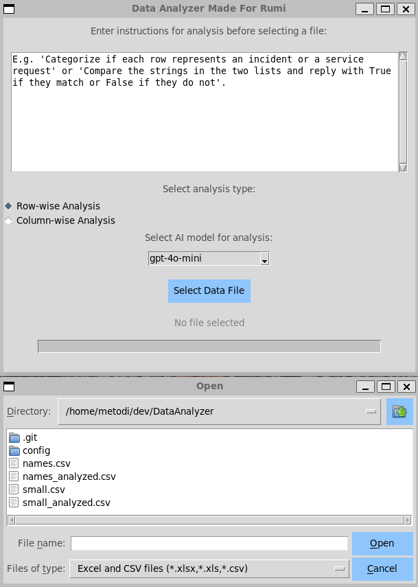

# DataAnalyzerApp

## Overview

I developed this app for my wife. 

DataAnalyzerApp is a Python-based graphical application that allows users to analyze data files in Excel and CSV formats. The app provides a simple user interface for specifying analysis instructions, selecting data columns, and executing custom NLP analysis using OpenAI's Model API.

The application is built using the `tkinter` library for UI and leverages `multiprocessing` to speed up the analysis by using multiple CPU cores. The app is suitable for analyzing textual data, providing insights quickly and efficiently.

## Features
- Select and analyze data from Excel (`.xlsx`, `.xls`) or CSV (`.csv`) files.
- Input custom instructions for analysis.
- Select specific columns for analysis.
- Choose from several OpenAI models for analysis.
- Supports concurrent processing for faster processing using multiple CPU cores.
- Progress bar and status updates to inform users during long-running analyses.

## Prerequisites
- Python 3.10 or higher
  - `pandas`
  - `openpyxl`
  - `openai`
  - `xlrd`

## Installation
1. Clone the repository:
   ```sh
   git clone https://github.com/Met0o/DataAnalyzer.git
   cd DataAnalyzerApp
   ```
2. Install the required dependencies:
   ```sh
   pip install pandas openpyxl xlrd openai
   ```

## Usage
1. Run the application:
   ```sh
   python app.py
   ```
2. Enter the instructions for the type of analysis you wish to perform in the text box.
3. Click the "Select Data File" button to choose an Excel or CSV file.
4. A pop-up window will allow you to select the columns for analysis.
5. Pick one of the avaialble models to perform the analysis.
6. The analysis progress will be displayed using the progress bar.
7. Once complete, the analyzed file will be saved with a suffix `_analyzed` in the original file's directory.

## Configuration
- **CPU Cores**: The app automatically detects the number of available CPU cores using `multiprocessing.cpu_count()`, allowing the workload to be distributed efficiently.
- **Output File**: The analyzed data is saved in the same format as the original file, with `_analyzed` appended to the filename.
- **Analysis Instructions**: Provide specific instructions in the text box for how the analysis should be conducted (e.g., "Perform sentiment analysis on the comments").
- **Model Selection**: Pick one of 3 models, GPT-4o being most capable, followed by GPT-4o-mini, and GPT-4-Turbo.

## Screenshots

*Main User Interface of ExcelAnalyzerApp*

## Notes
- Make sure you have an active API key for OpenAI to use the application.

## Troubleshooting
- **Unsupported File Format**: If you get an error about an unsupported file, ensure you select either `.xlsx`, `.xls`, or `.csv` files.
- **OpenAI API Errors**: If there are issues connecting to the OpenAI API, verify your API key and network connection.
- **Empty File Warning**: If the selected file is empty, the app will notify you. Make sure the file contains valid data.
